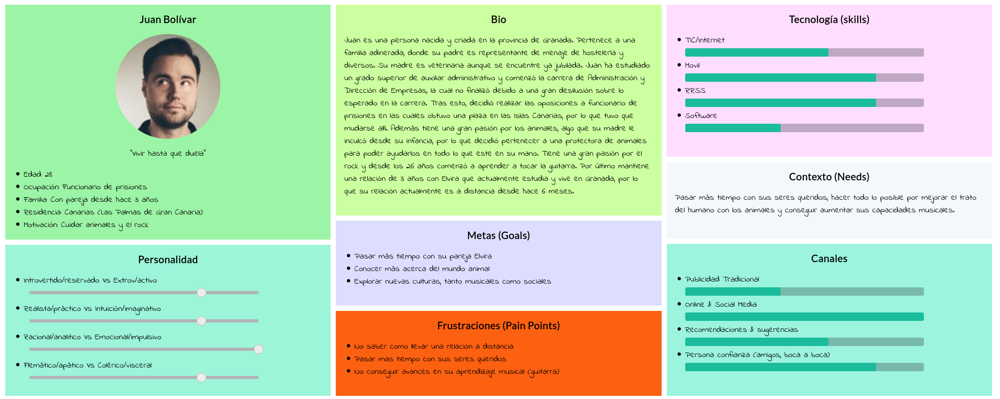
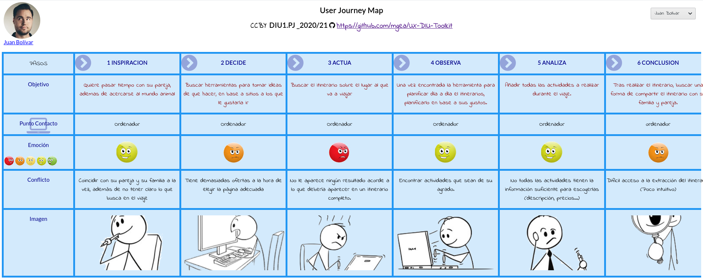

## DIU - Practica1, entregables

## 1. Competitor Analysis

La aplicación que hemos elegido frente a las otros competidores es la de Inspirock. Debido a que esta aplicación tiene unos puntos fuertes e innovadores bastante interesantes , como por ejemplo es la realización de itinerarios concretos dentro de un período establecido y un lugar concreto. Dicha función puede llegar a ser muy específica como por ejemplo indicar el horario de las visitas a los lugares indicados de interés(culturales , deportivos , gatronómicos , etc). Además dicho itinerario puede ser especificado con las rutas más optimas. Una de las desventajas que puede tener es la que estas actividades  son redirigidas a otras páginas para efectuar sus reservas  y si existen algún cambio o incoveniente como cancelaciones, ellos no se hacen responsables. Otra de las desventajas será el pequeños espectro de idiomas que ofrece, algo clave para una aplicación de viajes.

## 2. Personas

En primer lugar tenemos al usuario de Juan Bolivar, una persona con unas cualidades y conocimientos de tecnología actuales elevados. Debido a que se encuentra en un puesto de trabajo en el cuál debe usar ciertas herramientas de ofimática(como en general las personas), además que al ser una persona más joven tiene más facilidad de aprendizaje de nuevas tecnologías.

En segundo lugar tenemos Aliona Ekaterina, una persona que no ha estado tan familiarizada con las tecnologías actuales. Debido a las circunstancias personales que ha tenido en su vida , por tanto es un tipo de usuario que no tendrá tanta facilidad de comprensión y acceso a nuevas herramientas que no conozca previamente.

## 3. Journey Maps

Tenemos dos casos muy opuestos una persona familiarizada con las tecnologías que teniendo una cierta formación consigue el objetivo de obtener su itinerario (aunque tuve algunas dudas). Y una segunda persona que no esta familiarizada con el uso de la tecnología que tras no encontrar ayuda ni resultados o guias de funcionamiento claras dentro de la web decide rechazar nuestra página.

## 4. Revisión de usabilidad

[Documento de review de usabilidad](./P1/Usability-review-realizado.pdf)

En conclusión creemos que la puntuación refleja bien la usabilidad de la plataforma. Encontramos una página bastante equilibrada, con puntos fuertes y puntos débiles. Entre los puntos débiles podemos resaltar algunos problemas de accesibilidad debido a que muchas etiquetas de acciones no representan correctamente el resultado que finalmente se obtiene. Además la falta de apoyo de uso hace que requiera una pequeña curva de aprendizaje al usar la plataforma por primera vez. Como puntos fuertes destaca la interfaz de la aplicación, la cual es bastante limpia y clara. Además proporciona feedbacks de cada una de la actividades obtenidos de servicios externos que permiten hacerse una idea de como puede ser una actividad. Una vez tienes cierto conocimiento de como usar la página, permite una gran variedad de opciones relacionadas con los itinerarios (cambiar horarios, modificar actividades, etc.).

---

## A partir de aquí abajo se borra antes de entregar

- Desk research: Análisis Competencia 
- 2 Personas 
- 2 User Journey Map  ( 1 por persona)
- Revisión de Usabilidad 

(valoración y conclusiones de esta etapa)
