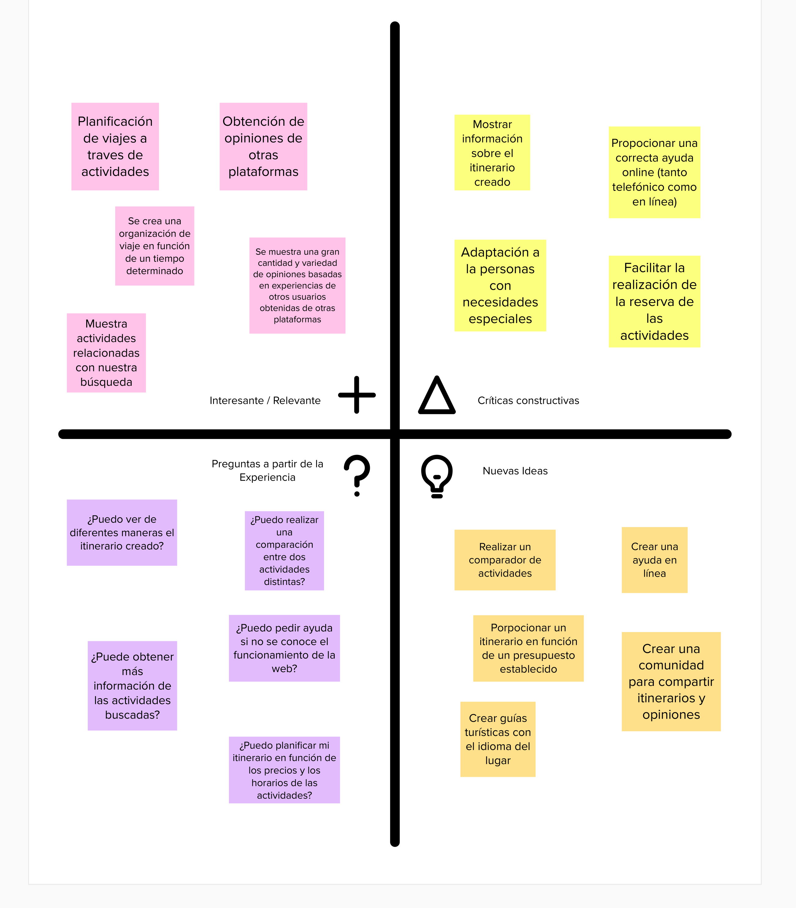
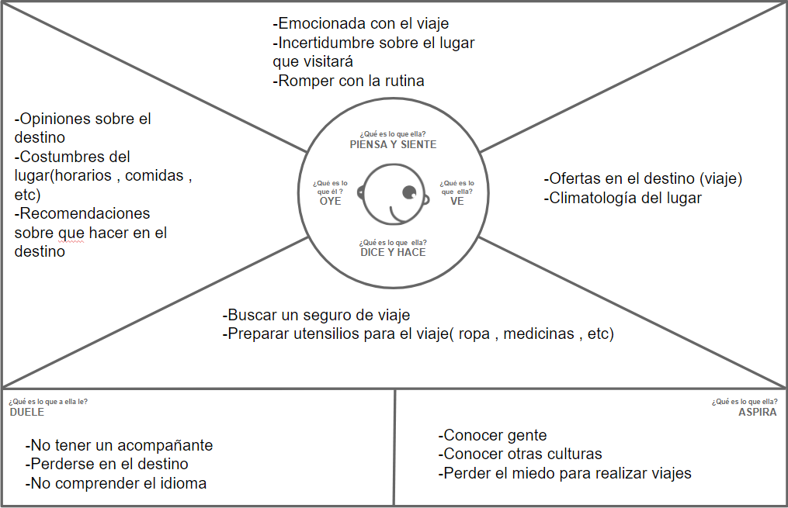
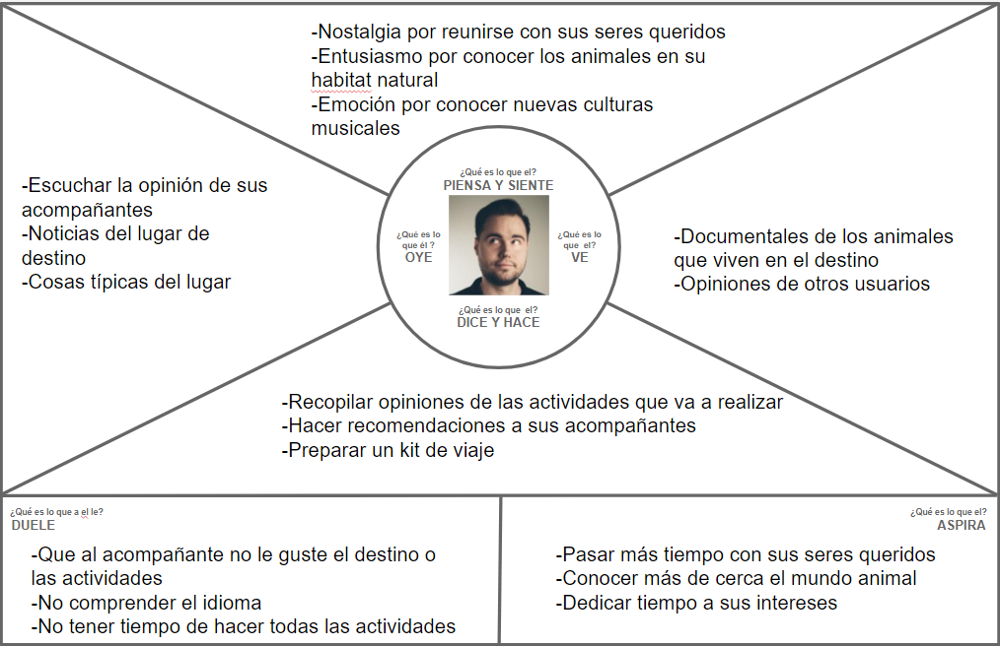
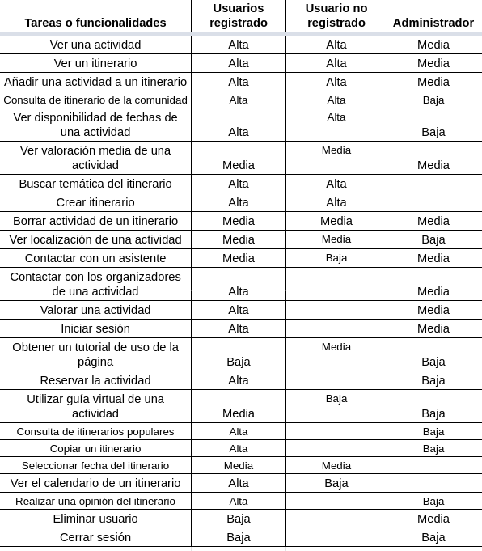
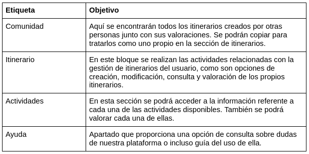

## DIU - Practica2, entregables

### Ideación 

#### Malla receptora de información 

#### Mapa de empatía

**Aliona Ekaterina**

**Juan Bolivar**

#### Point of View 

|           Usuario           |                                    Necesidad                                   |                                                                                                  Insight                                                                                                 |
|:---------------------------:|:------------------------------------------------------------------------------:|:--------------------------------------------------------------------------------------------------------------------------------------------------------------------------------------------------------:|
|       Padre de familia      |        Encontrar un viaje romántico y diferente para hacer con su mujer        | Los últimos viajes realizados le han parecido demasiado monótonos, realizando las actividades típicas del destino, por lo que buscar realizar un itinerario diverso con actividades de diferentes tipos. |
|       Grupo de amigos       |  Organizar un itinerario exótico para la despedida de soltero de uno de ellos  |                             Las agencias de viajes y plataformas más conocidas les han propuesto viajes típicos en lugar de viajes más orientados a la diversión y la fiesta.                            |
| Aficionado a la gastronomía | Crear un plan de viaje para conocer y probar las comidas de diferentes lugares |      Quiere centrar su viaje en conocer mejor la gastronomía de otros lugares y no tanto en conocer su cultura. Para esto buscar realizar planes relacionados con actividades menos convencionales.      |

### PROPUESTA DE VALOR

Nuestro proyecto llamado Tranger consiste en una plataforma de creación de itinerarios alternativos. Dichos itinerarios pueden ser de diferentes temáticas(cultural, gastronómicos,deportivos,etc) , además se proporcionará una comunidad de la plataforma para consultar las experiencias de los usuarios en estos itinerarios o actividades. Por último se proporciona un guía turístico nativo del lugar que se visita para proporcionar una expercienca más intima y formativa de la actividad.

### TASK ANALYSIS

Hemos decidido usar una matriz de tareas/usuarios(User/task matrix) debido a que expresa de forma más clara las principales funciones y relevancia que tienen una tarea con respecto del tipo de usuario , solamente con realizar un barrido visual. Mientras que bajo nuestro punto de vista los flujos de usuario y tareas no muestran con claridad la funcionalidad o tipo de usuario solamente con un vistazo sino que estaría más enfocados a un diseño o boceto , el cuál realizaremos en un puntos posteriores.

### ARQUITECTURA DE INFORMACIÓN

#### Sitemap

#### Labelling 

En el apartado de labelling vamos a seleccionar los 5 grandes bloques de nuestra plataformas debido a que dentro de ellos las acciones son bastantes concretas.

### Prototipo Lo-FI Wireframe 

#### Inicio y login

#### Itinerario

#### Actividades

#### Ayuda

#### Comunidad

### Conclusiones  
(incluye valoración de esta etapa)
