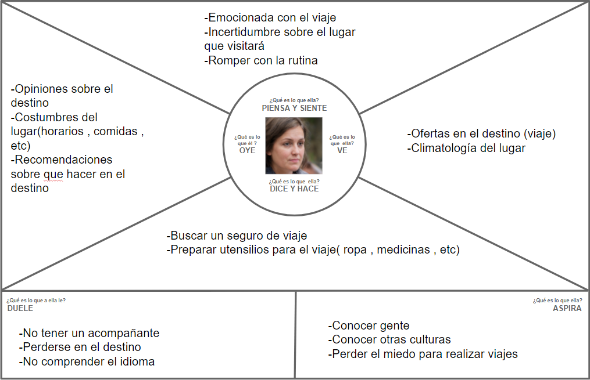
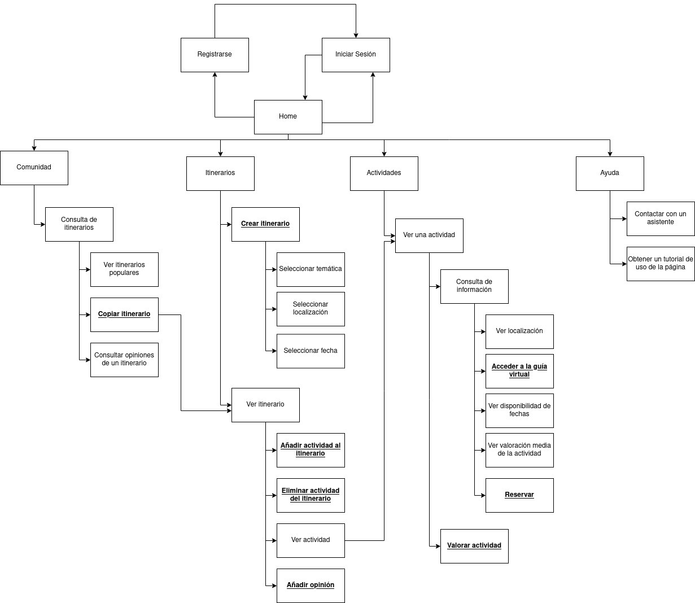
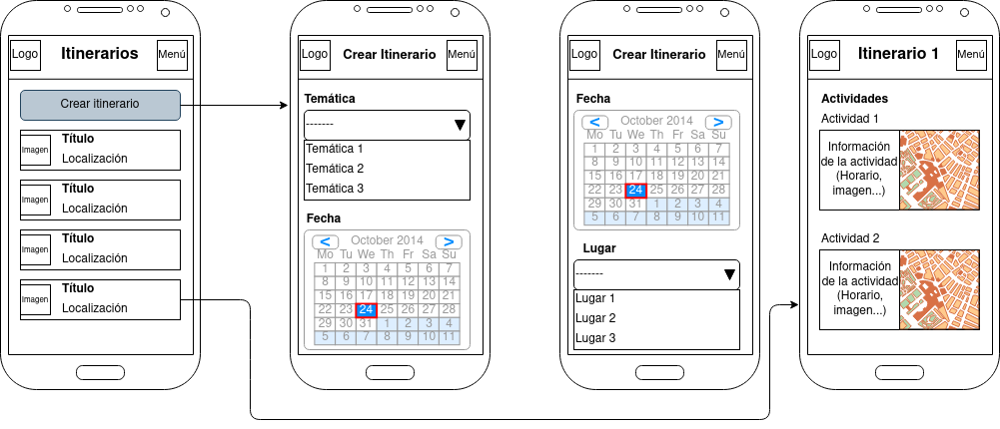

## DIU - Practica2, entregables

### Ideación 

#### Malla receptora de información 

En primer lugar tenemos la realización de nuestra malla receptora, en la cual buscamos realizar un estudio y exploración de las principales ideas que buscamos en nuestra aplicación y analizar los puntos débiles de la aplicación estudiada en la práctica 1. Para esta tarea hemos utiliza la aplicación web de MURAL.

#### Mapa de empatía

En nuestro mapa de empatía hemos realizado el análisis de nuestra idea de  aplicación "Tranger" desde el punto de vista de los usuarios creados en la práctica 1, los cuales eran Aliona Ekaterina y Juan Bolivar. Como bien se muestra a continuación se analiza y expone las principales sensaciones y pensamientos de estos usuarios.

**Aliona Ekaterina**

**Juan Bolivar**

#### Point of View 

|           Usuario           |                                    Necesidad                                   |                                                                                                  Insight                                                                                                 |
|:---------------------------:|:------------------------------------------------------------------------------:|:--------------------------------------------------------------------------------------------------------------------------------------------------------------------------------------------------------:|
|       Padre de familia      |        Encontrar un viaje romántico y diferente para hacer con su mujer        | Los últimos viajes realizados le han parecido demasiado monótonos, realizando las actividades típicas del destino, por lo que buscar realizar un itinerario diverso con actividades de diferentes tipos. |
|       Grupo de amigos       |  Organizar un itinerario exótico para la despedida de soltero de uno de ellos  |                             Las agencias de viajes y plataformas más conocidas les han propuesto viajes típicos en lugar de viajes más orientados a la diversión y la fiesta.                            |
| Aficionado a la gastronomía | Crear un plan de viaje para conocer y probar las comidas de diferentes lugares |      Quiere centrar su viaje en conocer mejor la gastronomía de otros lugares y no tanto en conocer su cultura. Para esto buscar realizar planes relacionados con actividades menos convencionales.      |

### PROPUESTA DE VALOR

Nuestro proyecto llamado Tranger consiste en una plataforma de creación de itinerarios alternativos. Dichos itinerarios pueden ser de diferentes temáticas(cultural, gastronómicos,deportivos,etc) , además se proporcionará una comunidad de la plataforma para consultar las experiencias de los usuarios en estos itinerarios o actividades. Por último se proporciona un guía turística de la actividad en el idioma nativo del lugar que se visita, disponible en formato de audio y de vídeo.

### TASK ANALYSIS

Hemos decidido usar una matriz de tareas/usuarios(User/task matrix) debido a que expresa de forma más clara las principales funciones y relevancia que tienen una tarea con respecto del tipo de usuario , solamente con realizar un barrido visual. Mientras que bajo nuestro punto de vista los flujos de usuario y tareas no muestran con claridad la funcionalidad o tipo de usuario solamente con un vistazo sino que estaría más enfocados a un diseño o boceto , el cuál realizaremos en un puntos posteriores.

|             Tareas o funcionalidades             | Usuarios registrado | Usuario no registrado | Administrador |
|:------------------------------------------------:|:-------------------:|:---------------------:|:-------------:|
| Ver una actividad                                |         Alta        |          Alta         |     Media     |
| Ver un itinerario                                |         Alta        |          Alta         |     Media     |
| Consulta de itinerario de la comunidad           |         Alta        |          Alta         |      Baja     |
| Ver disponibilidad de fechas de una actividad    |         Alta        |          Alta         |      Baja     |
| Ver valoración media de una actividad            |        Media        |         Media         |     Media     |
| Buscar temática del itinerario                   |         Alta        |          Alta         |               |
| Añadir una actividad a un itinerario             |         Alta        |                       |     Media     |
| Crear itinerario                                 |         Alta        |                       |     Media     |
| Ver localización de una actividad                |        Media        |         Media         |      Baja     |
| Contactar con un asistente                       |        Media        |          Baja         |     Media     |
| Contactar con los organizadores de una actividad |         Alta        |                       |     Media     |
| Valorar una actividad                            |         Alta        |                       |     Media     |
| Iniciar sesión                                   |         Alta        |                       |     Media     |
| Utilizar guía virtual de una actividad           |         Alta        |                       |     Media     |
| Borrar actividad de un itinerario                |        Media        |                       |     Media     |
| Obtener un tutorial de uso de la página          |         Baja        |         Media         |      Baja     |
| Reservar la actividad                            |         Alta        |                       |      Baja     |
| Consulta de itinerarios populares                |         Alta        |                       |      Baja     |
| Copiar un itinerario                             |         Alta        |                       |      Baja     |
| Seleccionar fecha del itinerario                 |        Media        |         Media         |               |
| Ver el calendario de un itinerario               |         Alta        |          Baja         |               |
| Realizar una opinión del itinerario              |         Alta        |                       |      Baja     |
| Eliminar usuario                                 |         Baja        |                       |     Media     |
| Cerrar sesión                                    |         Baja        |                       |      Baja     |

### ARQUITECTURA DE INFORMACIÓN

#### Sitemap

Para el *sitemap*, hemos querido reflejar el funcionamiento de la aplicación de forma clara. Hemos dividido esta en cuatro secciones, las cuales no son aisladas si no que están relacionadas entre si. Por otra parte, contemplando el uso de la aplicación de usuarios registrados y no registrados, hemos subrayado las acciones que solo podrán hacer los usuarios registrados. 

#### Labelling 

En el apartado de labelling vamos a seleccionar los 5 grandes bloques de nuestra plataformas debido a que dentro de ellos las acciones son bastantes concretas.

| **Etiqueta**    | **Objetivo**                                                                                                                                                                                              |
|:---------------:|:---------------------------------------------------------------------------------------------------------------------------------------------------------------------------------------------------------:|
| Comunidad       | Aquí se encontrarán todos los itinerarios creados por otras personas junto con sus valoraciones. Se podrán copiar para tratarlos como uno propio en la sección de itinerarios.                            |
| Itinerario      | Conjunto de actividades a realizar en un viaje o visita a un lugar o localización.                                                                                                                        |
| Actividades     | Actividad realizada en un itinerario. Podrían ser eventos, lugares a visitar, planes...                                                                                                                   |
| Ayuda           | Apartado que proporciona una opción de consulta sobre dudas de nuestra plataforma o incluso guía del uso de ella.                                                                                         |
| Opinión         | Comentario escrito sin puntuación de un usuario acerca de un itinerario completo, enfocado a que se compartan experiencias entre usuarios.                                                                |
| Valorar         | Acción que permite obtener una ponderación del nivel de satisfacción del usuario dentro de la actividad, se realiza principalmente con un sistema de estrellas (1 estrella= malo; 5 estrellas=muy bueno). |
| Guía turística  | Guía acerca de una actividad, disponible en audio y texto, para ofrecer al usuario una mejor experiencia realizando esta actividad.                                                                       |
| Tutorial de uso | Indicaciones en pantalla para el usuario sobre las diferentes secciones y acciones principales de la app.                                                                                                 |
| Temática        | Clasificación del itinerario o actividad según su tipo o hacia quien esté orientada. Algunos ejemplos son: gastronómico, arquitectónico, cultural...                                                      |
| Reservar        | Indicar una fecha para realizar esa actividad, para que esta sea reservada por los organizadores.                                                                                                         |
| Registro        | Acción para la creación de un usuario. A este se le solicitará el correo electrónico, así como una contraseña para acceder.                                                                               |

### Prototipo Lo-FI Wireframe 

En este último apartado, hemos buscado realizar una serie de bocetos de los 5 campos más grandes que hemos propuesto para nuestra aplicación como son: inicio, comunidad, actividad, ayuda e itinerarios. Dentro de cada apartado mostramos pequeños ejemplos de nuestro diseño o idea inicial para mostrar al usuario, y como esperamos que responda nuestra app de cara a este. Para esta tarea hemos usado la herramienta draw.io la cual nos fue muy útil para este trabajo por su versatilidad y adaptabilidad para crear diseños de todo tipo.

#### Inicio y login

#### Itinerario

#### Actividades

#### Ayuda

#### Comunidad

### Conclusiones  

Creemos que la práctica ha sido muy completa. Nos ha gustado que sea progresiva y que cada una de las partes estén relacionadas entre si, lo que nos ha permitido ir corrigiendo aspectos anteriores conforme la realizábamos. Desde un punto de vista más técnico, lo aprendido en la práctica nos ha proporcionado ese punto de análisis sobre las cuestiones menos técnicas, del que muchas veces se carece en los proyectos. Esto nos permite encontrar el equilibrio, entre funcionalidad y usabilidad, fijando de forma clara el objetivo final.

Como punto negativo creemos que la continuidad con la práctica 1 no es tan clara. Quizás podría enfocarse en diseñar una aplicación directamente relacionada con la práctica 1, buscando solucionar problemas encontrados en esta.
