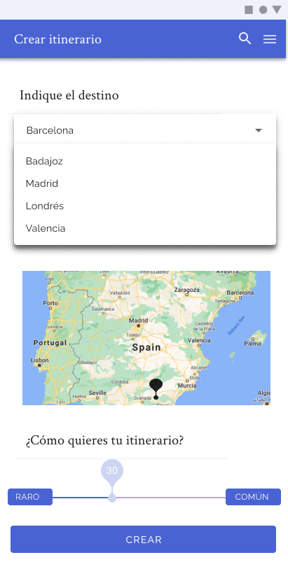

# DIU - Practica 3, entregables

## Moodboard (diseño visual + logotipo)   

### Colores

En primer lugar, mostramos la paleta de colores elegida por nosostros. En dicha gama de colores hemos querido incluir un azúl como color principal y un tono amarillo pastel como color secundario. Para la elección de estos colores, nos hemos basado en la temática de la aplicación, los viajes, más concretamente en uno de los destinos principales de estos las playas. Los hemos elegido ya que queríamos transmitir una sensación de libertad y de relajación.

Hemos elegido solo dos colores ya que los patrones y guidelines que seguiremos recomiendan el uso de dos principales ( aunque utilizaremos toda la gama de grises de ambos ). También hemos querido añadir un tono rojo/turquesa para todo el tema de advertencias en la aplicación. El tono negro lo utilizaremos para textos.

### Tipografías

Hemos decidido escoger dos fuentes principales para nuestra aplicación. Según las guidelines seguidas, hemos utilizado la tipografía "Crimson text", una letra de tipo Serif para los títulos, subtítulos y elementos destacables, ya que buscamos que sea de fácil lectura para los usuarios. La segunda de las tipografías son "Raleway" de la modalidad de San Serif que son un tipo de escritura más suave y cómoda que no tiene tantos remates o detalles y que se suelen usar mucho para uso. En este caso hemos querido utilizar otra alternativa a las propuestas de Material Design para dar una mayor personalidad a nuestra aplicación.

### Iconografía

En el apartado de iconografía, hemos utilizado la que nos proporciona predeterminada de Material Design para mantener una línea paralela al diseño.

### Logotipo

Con respecto al apartado del Logotipo, hemos querido que siga la misma gama de colores de nuestra paleta, variando solamente en la sombra de nuestro azul. Además la imagen representada busca representar la forma de un país, sin representar a ninguno en específico, para de esta forma despertar interés por cosas nuevas o nuevos lugares en nuestros usuarios y comunicar indirectamente el ámbito de nuestro proyecto.

### Imágenes inspiradoras

En el apartado de imágenes inspiradoras, hemos intentado seguir el mismo estilo que se usa actualmente en la apps de viajes pero quedándonos con los detalles que nos parecen más interesantes de cara al usuario. Dichos detalles son en la primera imagen de la app "Bali" su forma de presentación de los lugares que se visitan para de esta forma mostrarlo nosotros en las actividades de nuestros itinerarios. 

Después tenemos la apps "Travel" la cual usa tonos de colores muy similares a los que buscamos para transmitir desconexión y ruptura de la rutina. 

Y por último tenemos la imagen del mar, que nos ha servido de inspiración para la creación de nuetsra paleta de colores, ya que buscamos transmitir esa idea.

## Landing Page

Para el landing page, hemos seguido el estilo marcado en el moodboard, utilizando los colores y tipografías seleccionadas. Al entrar aparecería el titular principal con un slogan y un titular de apoyo para este. Además de esto, el usuario se enontrará la llamada a la acción en un color bastante más llamativo reclamando la total atencióñ de este, ya que el objetivo principal de la landing page debe ser que el usuario cree un usuario o visite la página. 

Al hacer scroll aparecerá las características diferenciadoras (o benefícios) de la plataforma frente a otras alternativas. Además aparecerán nuevas declaraciones de refuerzo junto con nuevas imágenes que refuerzan el discurso de la "marca".

Por último, introducimos un argumento de cierre que hace referencia a otra de las partes diferenciales de nuestra plataforma, añadiendo un botón de ayuda por si el usuario tiene dudas sobre la plataforma antes de registrarse.

Para realizarlo hemos utilizado Figma.

## Patrones de diseño y guidelines

Tras ver varios patrones y guidelines hemos decidido basarnos en Material Design. Al ser una aplicación móvil, creemos que seguir esto nos va a permitir llegar a un resultado maduro y correcto. Para decidir los patrones de diseño a seguir, nos hemos fijado en partes importantes que queríamos que tuviese nuestra página:

### [Navigation drawer](https://material.io/archive/guidelines/patterns/navigation-drawer.html)

En primer lugar, creemos que la forma de navegación es una de las partes esenciales de la experiencia de usuario de una aplicación móvil. Hemos decidido utilizar un menú de navegación oculto que aparecerá al pulsar un botón “hamburguesa”. Aquí se encontrarán las secciones de la aplicación. Hemos decido utilizar esta solución ya que las secciones no están tan delimitadas como en otros tipos de aplicaciones. Por ejemplo, en nuestro caso los itinerarios se componen de actividades, por lo que estas dos secciones están conectadas entre sí y no están tan diferenciadas, como por ejemplo podría ocurrir en una aplicación que ofreciese diversos servicios independientes unos de otros. 

### [Búsqueda](https://material.io/archive/guidelines/patterns/search.html#search-in-app-search)

La búsqueda es otra de las funcionalidades esenciales que deberá tener nuestra aplicación. No se concibe una aplicación de viajes sin un mecanismo de búsqueda que permita al usuario obtener lo que quiere. Debido a esto, en los apartados en los que se contempla, como por ejemplo las actividades, hemos decidido seguir un patrón de búsqueda permanente, en el que siempre será visible una barra de búsqueda, en la que el usuario pueda introducir información usada para filtrar las actividades mostradas. 

La barra de búsqueda aparecerá como un elemento siempre visible. Una vez enfocado, la información pasará a ocupar toda la pantalla.

### [Ayuda](https://material.io/archive/guidelines/patterns/help-feedback.html#help-feedback-placement)

En nuestro apartado de ayuda vamos a utilizar en primer lugar un “Cajón de navegación”. Este funcionamiento consiste en añadir el apartado “AYUDA”como último elemento en el panel de navegación.Si aparece "Cerrar sesión" en el panel de navegación, debería ser el último elemento de la lista. 

Tras realizar el uso de este apartado, se llevará al usuario directamente al contenido de ayuda al seleccionar "Ayuda" en su aplicación.

### [Scroll](https://material.io/archive/guidelines/patterns/scrolling-techniques.html# )

Para la técnica de desplazamiento que vamos a tener en nuestra apps, utilizaremos tres comportamientos de desplazamiento  principalmente ya que lo vimos necesario para el diseño y funcionamiento que queremos para nuestra apps. Los comportamientos son la barra de aplicaciones estándar, la barra de aplicaciones flexible y el espacio flexible con imagen.

- En primer lugar tenemos la barra de aplicaciones estándar, que al igual que los tres tipos de comportamientos de desplazamiento siempre tendremos la parte fija de la barra de estado del teléfono.

    

    En este estilo siempre tendremos la parte superior de nuestro diseño fija con las opciones de menú y vuelta al inicio que planteamos en la práctica 2.
    
    

- En segundo lugar tenemos el comportamiento de espacio flexible. El cual tiene una composición algo similar a la anterior, solamente que nos permite la introducción de herramientas en el apartado de espacio flexible como es la indicación del apartado en el que nos encontramos, la creación de nuevos itinerarios o funcionalidades principales para la pantalla o bloque en el cual estamos trabajando(itinerarios,actividades,etc) como bien mostramos en nuestros bocetos.

    

    La estructura de este comportamiento sería la siguiente:
    
    

- Por último tenemos el tercer comportamiento la barra de espacio flexible con imagen. La cual nos permite acomodar imágenes en la barra de la aplicación con la relación de aspecto deseada, como bien puede ocurrir en nuestro apartado de actividades mostrando una imagen de la actividad, su descripción, localización, etc.

    

    La estructura de este comportamiento sería la siguiente:

    

### Guidelines

Para el diseño de la aplicación seguiremos principalmente las guidelines de Material Design, ya que nos hemos basado en sus patrones de diseño. Al ser una estilo muy maduro y completo, creemos que nos proporcionará tanto componentes como estilos necesarios para nuestro diseño. Por otra parte, en cuanto a los colores y las tipografías, hemos decidido utilizar nuestro propio estilo, para dar más personalidad y adaptar nuestra aplicación.

## Mockup: LAYOUT HI-FI

Los diseños se pueden visualizar de forma "maquetada" [aquí](https://www.figma.com/proto/NRGrsRK6On0TyEOZ2AJ5Db/Material-Baseline-Design-Kit-(Community)?node-id=5%3A5880&scaling=scale-down&page-id=4%3A0).

Para realizar los diseños hemos utilizado Figma, con las plantillas de Material Design.

|                  |                   |                   |
|------------------|-------------------|-------------------|
 |  |  |
 |  |  | 
 |  |                   | 

## Caso de estudio

El caso de estudio está reflejado en el [readme principal](../README.md) y en el siguiente vídeo: 

https://user-images.githubusercontent.com/31637109/118174813-95864780-b42f-11eb-8f3d-2a631d21447e.mp4

## Conclusión

Hemos visto esta práctica muy completa en todos los sentidos. Nos gusta que haya sido tan secuencial, siguiendo un camino "iterativo" aplicando en cada paso lo realizado en el anterior. Por otra parte, nos ha gustado que tenga una continuidad con la anterior práctica, cosa que criticamos con las anteriores. 

En cuanto a carga de trabajo, creemos que se podría haber distribuido en diferentes prácticas y hacer cada una de las partes más específica. 

En general creemos que ha sido bastante completa y útil.