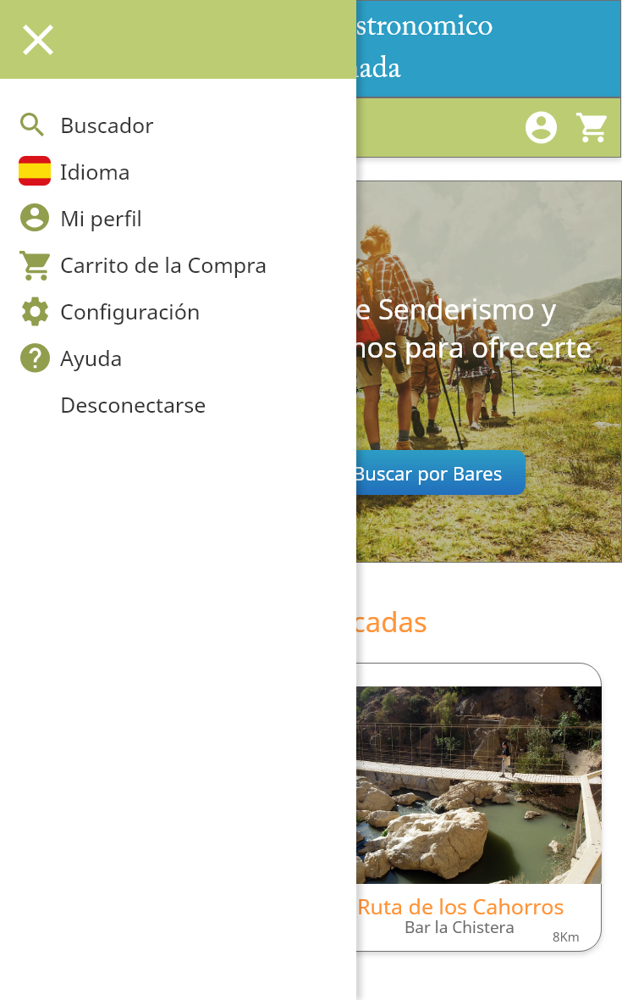
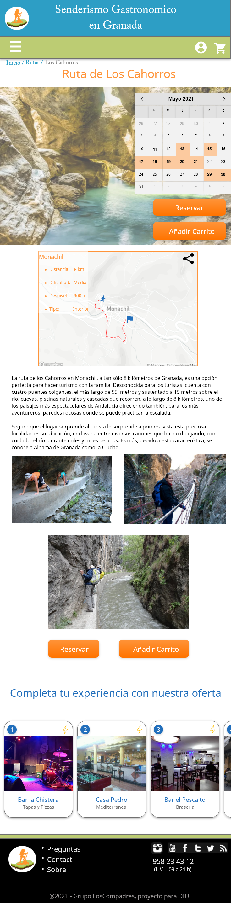

# DIU - Practica 4, entregables

Para realizar evaluar el diseño de dos tipos de proyectos diferentes cuyas ideas principales es semejante, hemos decidido realizar un A/B testing con la simulación de dos personas ficticias. Esta simulación se ha hecho con personas semejantes a estas aplicando una serie de tareas y finalmente realizando un cuestionario SUS a estas, con el objetivo de obtener una puntuación mediante la cual se pueda evaluar cada una de las alternativas. 

## Caso 1

El primero de los casos es el nuestro propio, la aplicación **Tranger**. Para esta hemos creado dos personas ficticias de forma aleatoria. A partir de estas creaciones, hemos buscado personas con perfiles parecidos, para aplicar el proceso.

| #id.usuario | Sexo/edad | Ocupación         | Experiencia internet | Plataforma         | Perfil cubierto                    | TEST | SUS score |
|-------------|-----------|-------------------|----------------------|--------------------|------------------------------------|------|-----------|
| 352         | Hombre / 42   | Desempleado       | Media                | Windows / Android  | Amigable, Fotógrafo, Asustado      | A    | 75        |
| 533         | Mujer / 33    | Comercial         | Media                | Windows/ Iphone    | Trabajadora, Bailar, Feliz         | A    | 80        |

Para la evaluación, las tareas propuestas a realizar por el usuario son las siguientes: 

- Registro e inicio de sesión
- Búsqueda de un itinerario de un tema específico
- Duplicación de un itinerario
- Consulta de opiniones
- Solicitud de ayuda

| Participant      | Task 1 | Task 2 | Task 3 | Task 4 | Task 5 |
|------------------|:------:|:------:|:------:|:------:|:------:|
|         1        |    √   |   √    |    -   |   √    |    -   |
|         2        |    √   |   √    |    √   |   √    |    √   |
|      Success     |    2   |    2   |    1   |    2   |   1    |
| Completion Rates |  100%  |  100%  |  50%  |   100%  |   50%  |

Una vez realizadas las tareas realizamos se le aplica el cuestionario SUS a los usuarios, obteniendo los resultados siguientes:

|    | PREGUNTAS                                                                                |  1 | 2 | 3 | 4 | 5 |
|----|------------------------------------------------------------------------------------------|:--:|:-:|:-:|:-:|:-:|
| 1  | Creo que me gustará visitar con frecuencia este website                                  |    |   | 1 | 1 |   |
| 2  | Encontré el website innecesariamente complejo                                            |  1 | 1 |   |   |   |
| 3  | Pensé que era fácil utilizar este website                                                |    |   |   | 1 | 1 |
| 4  | Creo que necesitaría del apoyo de un experto para recorrer el website                    |    | 1 |   | 1 |   |
| 5  | Encontré las funciones del website bastante bien integradas                              |    |   |   | 2 |   |
| 6  | Pensé que había demasiada inconsistencia en el website                                   |    | 2 |   |   |   |
| 7  | Imagino que la mayoría de las personas aprenderían muy rápidamente a utilizar el website |    |   | 1 |   | 1 |
| 8  | Encontré el website muy grande al recorrerlo                                             |  1 | 1 |   |   |   |
| 9  | Me sentí muy confiado en el manejo del website                                           |    |   | 1 | 1 |   |
| 10 | Necesito aprender muchas cosas antes de manejarme en el website                          |    | 2 |   |   |   |
|    |                                                                         Valoración final | 77.5 |   |   |   |   |

*Los datos del cuestionario SUS se pueden encontrar en la [hoja de cálculo](./Cuestionario_SUS.xlsx) o [PDF](./Cuestionario_SUS.pdf) correpondiente*

A la hora de analizar los resultados hemos decidido utilizar la escala *Adjective* debido a que es una escala no demasiado exigente para ver buenos resultados, y que permite separar buenos resultados de excelentes, al igual que malos de nefastos. Se puede ver un nivel de estudio más específico utilizando esta escala.  

Con una puntuación media de **77.5**, entraría dentro del apartado de bueno. Esto nos hacer ver que el diseño es correcto pero tiene algunos apartados por pulir. El diseño es correcto pero se debería buscar diseños más fáciles de comprender para el usuario, aumentando así la comodidad de la visita a la plataforma, buscando alternativas más cotidianas para el usuario.

## Caso 2

El análisis del caso B será del producto [**Senderismo Gastronómico en Granada**](https://github.com/MiguelangelX72/DIU21/). Al igual que en el caso anterior, hemos creado dos personas ficticias de forma aleatoria. A partir de estas creaciones, hemos buscado personas con perfiles parecidos, para aplicar el proceso. 

| #id.usuario | Sexo/edad | Ocupación         | Experiencia internet | Plataforma         | Perfil cubierto                    | TEST | SUS score |
|-------------|-----------|-------------------|----------------------|--------------------|------------------------------------|------|-----------|
| 221         | Mujer / 66 | Jubilada          | Baja                 | Windows / Android  | Familiar,  Hablar idioma, Enfadada | B    | 50        |
| 515         | Hombre / 53 | Director de banco | Alta                 | Mac / Iphone       | Trabajador, estudiar, disgustado   | B    | 70        |

Para la evaluación, las tareas propuestas a realizar por el usuario son las siguientes: 

- Registro e inicio de sesión en la página
- Búsqueda de una ruta específica
- Reserva de bares alrededor de la ruta (caso 2)
- Solicitud de ayuda en la página
- Cancelación de una reserva.

| Participant      | Task 1 | Task 2 | Task 3 | Task 4 | Task 5 |
|------------------|:------:|:------:|:------:|:------:|:------:|
|         1        |    √   |   √    |    -   |   √    |    -   |
|         2        |    √   |   √    |    √   |   √    |    √   |
|      Success     |    2   |    2   |    1   |    2   |   1    |
| Completion Rates |  100%  |  100%  |  50%  |   100%  |   50%  |

Una vez realizadas las tareas realizamos se le aplica el cuestionario SUS a los usuarios, obteniendo los resultados siguientes:

|    | PREGUNTAS                                                                                |  1 | 2 | 3 | 4 | 5 |
|----|------------------------------------------------------------------------------------------|:--:|:-:|:-:|:-:|:-:|
| 1  | Creo que me gustará visitar con frecuencia este website                                  |    | 1 |   | 1 |   |
| 2  | Encontré el website innecesariamente complejo                                            |  1 |   | 1 |   |   |
| 3  | Pensé que era fácil utilizar este website                                                |    |   | 1 | 1 |   |
| 4  | Creo que necesitaría del apoyo de un experto para recorrer el website                    |  1 | 1 |   |   |   |
| 5  | Encontré las funciones del website bastante bien integradas                              |    | 2 |   |   |   |
| 6  | Pensé que había demasiada inconsistencia en el website                                   |    |   | 2 |   |   |
| 7  | Imagino que la mayoría de las personas aprenderían muy rápidamente a utilizar el website |    |   |   | 2 |   |
| 8  | Encontré el website muy grande al recorrerlo                                             |    |   |   | 2 |   |
| 9  | Me sentí muy confiado en el manejo del website                                           |    |   |   | 2 |   |
| 10 | Necesito aprender muchas cosas antes de manejarme en el website                          |  1 |   |   |   |   |
|    |                                                                         Valoración final | 60 |   |   |   |   |

*Los datos del cuestionario SUS se pueden encontrar en la [hoja de cálculo](./Cuestionario SUS DIU.xlsx) o [PDF](./Cuestionario SUS DIU.pdf) correpondiente*

A la hora de analizar los resultados hemos decidido utilizar la escala *Adjective* debido a que es una escala no demasiado exigente para ver buenos resultados, y que permite separar buenos resultados de excelentes, al igual que malos de nefastos. Se puede ver un nivel de estudio más específico utilizando esta escala.  

### Problemas encontrados y soluciones propuestas

1. En primer lugar, encontramos una captura de la apps estudiada y visualizamos un error claro de diseño como es el del apartado “Carrito de la compra” del menú desplegable. Debido a que para este tipo de aplicaciones consideramos que no se realiza ningún tipo de compra sino una reserva ese apartado sería demasiado confuso tanto el título como el icono por lo que consideramos cambiarlos.

    

2. En esta segunda captura mostrada, volvemos a visualizar un botón de “Añadir Carrito”. El cual no aclara la función que realiza dentro de la apps ya que no se realiza ninguna compra sino una solicitud o búsqueda de ruta o reserva de un bar. O en un caso aclarar si las rutas explicadas son objetos de compra y se deben de adquirir, pero según la propuesta no sería de esta forma por lo que este botón consideramos que llevaría a error de comprensión y propondremos un cambio en el título del botón.

    

3.  Además de la gran extensión que tiene esta página, buscaríamos una solución para no mostrar tanta densidad de página como sería un scroll o poner un apartado de “Leer más” dentro del apartado de descripción de la actividad o ruta.

### Análisis final

Con una puntuación media de **60**, entraría dentro del apartado de *OK*. Esto nos hace ver que el diseño no es malo pero tiene varios puntos que corregir.

En primer lugar, ambos usuarios han destacado que algunas funciones de la plataforma no están suficientemente especificadas como por ejemplo el apartado de “Carrito de la Compra”. Debido a que no se realiza ninguna acción de comprar dentro de la aplicación sino acciones de reserva.

Además los usuarios han destacado negativamente el que la aplicación sea demasiado extensa en su recorrido. En lugar de recomendar bares y rutas en la página inicial, bajo nuestro punto de vista se podrían proponer los bares  tras la selección de las rutas. Además se podría eliminar algunos de los componentes, como por ejemplo el siempre mostrado título de la aplicación y su logo.

Por último, hemos detectado un problema con los colores del diseño de la aplicación. Debido a que no se muestra una armonía o “encaje” entre las diferentes gamas de colores que se usan.

A parte de estos problemas hemos considerado que es un app bastante completa y bien diseñada, aunque como todo proyecto siempre se pueden pulir determinados detalles.

Para este caso se ha realizado un [informe de usabilidad](./Usability-test.pdf)

## Conclusiones

Como bien hemos podido observar en las puntuaciones obtenidas para ambos casos, se considera mejor propuesta a Caso 1 "Tranger" con una puntuación de 77,5 mientras que el  Caso 2 "Senderismo Grastronómico en Granada" tendría una puntuación de 60. Aunque esto puede deberse también al tipo de usuario usado para el test A/B, ya que la muestra de usuarios es pequeña, bajo nuestro punto de vista la aplicación A tiene un mejor diseño e idea de proyecto, ya que la función que se propone en la aplicación B es un tipo de tarea común dentro de muchos foros de interés sobre senderismo.

Además hemos visualizado varios errores de diseño que podrían llevar al usuario a un mal uso o confusión dentro de la aplicacíón. Otra cosa a destacar es que el mercado al que va dirigida la propuesta B es muy reducido debido a que, como su nombre indica, solo está dirigida a gente de Granada.

## Conclusión sobre la práctica

Por último, nos gustaría concluir que esta práctica es una de las más importantes dentro de la asignatura ya que nos permite analizar con detenimiento los puntos fuertes y débiles de nuestra propuesta. Además que nos proporciona un caracter crítico de otras propuestas y puntos de vista diferentes para poder mejorar nuestro proyecto.