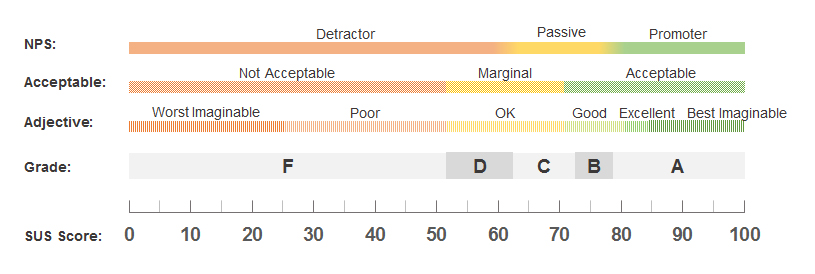

# DIU - Practica 4, entregables

Para realizar evaluar el diseño de dos tipos de proyectos diferentes cuyas ideas principales es semejante, hemos decidido realizar un A/B testing con la simulación de dos personas ficticias. Esta simulación se ha hecho con personas semejantes a estas aplicando una serie de tareas y finalmente realizando un cuestionario SUS a estas, con el objetivo de obtener una puntuación mediante la cual se pueda evaluar cada una de las alternativas. 

## Caso 1

El primero de los casos es el nuestro propio, la aplicación **Tranger**. Para esta hemos creado dos personas ficticias de forma aleatoria. A partir de estas creaciones, hemos buscado personas con perfiles parecidos, para aplicar el proceso.

| #id.usuario | Sexo/edad | Ocupación         | Experiencia internet | Plataforma         | Perfil cubierto                    | TEST | SUS score |
|-------------|-----------|-------------------|----------------------|--------------------|------------------------------------|------|-----------|
| 352         | Hombre    | Desempleado       | Media                | Windows / Android  | Amigable, Fotógrafo, Asustado      | A    | 75        |
| 533         | Mujer     | Comercial         | Media                | Windows/ Iphone    | Trabajadora, Bailar, Feliz         | A    | 80        |

Para la evaluación, las tareas propuestas a realizar por el usuario son las siguientes: 

- Registro e inicio de sesión
- Búsqueda de un itinerario de un tema específico
- Duplicación de un itinerario
- Consulta de opiniones
- Solicitud de ayuda

| Participant      | Task 1 | Task 2 | Task 3 | Task 4 | Task 5 |
|------------------|:------:|:------:|:------:|:------:|:------:|
|         1        |    √   |   √    |    -   |   √    |    -   |
|         2        |    √   |   √    |    √   |   √    |    √   |
|      Success     |    2   |    2   |    1   |    2   |   1    |
| Completion Rates |  100%  |  100%  |  50%  |   100%  |   50%  |

Una vez realizadas las tareas realizamos se le aplica el cuestionario SUS a los usuarios, obteniendo los resultados siguientes:

*Tabla SUS*

A la hora de analizar los resultados hemos dedicido utilizar la escala *Adjective* debido a que es una escala no demasiado exigente para ver buenos resultados, y que permite separa buenos resultados de excelentes, al igual que malos de nefastos. Se puede ver un nivel de estudio más específico utilizando esta escala.  

Con una puntuación media de **77.5**, entraría dentro del apartado de bueno. Esto nos hacer ver que el diseño es correcto pero tiene algunos apartados por pulir. El diseño es correcto pero se debería buscar diseños más fáciles de comprender para el usuario, aumentando así la comodidad de la visita a la plataforma, buscando alternativas más cotidianas para el usuario.

## Caso 2

El análisis del caso B será del producto [**Senderismo Gastronómico en Granada**](https://github.com/MiguelangelX72/DIU21/). Al igual que en el caso anterior, hemos creado dos personas ficticias de forma aleatoria. A partir de estas creaciones, hemos buscado personas con perfiles parecidos, para aplicar el proceso. 

| #id.usuario | Sexo/edad | Ocupación         | Experiencia internet | Plataforma         | Perfil cubierto                    | TEST | SUS score |
|-------------|-----------|-------------------|----------------------|--------------------|------------------------------------|------|-----------|
| 221         | Mujer     | Jubilada          | Baja                 | Windows / Android  | Familiar,  Hablar idioma, Enfadada | B    | 50        |
| 515         | Hombre    | Director de banco | Alta                 | Mac / Iphone       | Trabajador, estudiar, disgustado   | B    | 70        |

Para la evaluación, las tareas propuestas a realizar por el usuario son las siguientes: 

- Registro e inicio de sesión en la página
- Búsqueda de una ruta específica
- Reserva de bares alrededor de la ruta (caso 2)
- Solicitud de ayuda en la página
- Cancelación de una reserva.

<!-- | Participant      | Task 1 | Task 2 | Task 3 | Task 4 | Task 5 |
|------------------|:------:|:------:|:------:|:------:|:------:|
|         1        |    √   |   √    |    -   |   √    |    -   |
|         2        |    √   |   √    |    √   |   √    |    √   |
|      Success     |    2   |    2   |    1   |    2   |   1    |
| Completion Rates |  100%  |  100%  |  50%  |   100%  |   50%  | -->

Para este caso se ha realizado un (informe de usabilidad)(./Usability-test.pdf)

## Conclusiones

Creemos que la propuesta B necesita mejorar algunos aspectos, como evitar la sobrecarga de información en la plataforma, aclarar los apartados dentro de la aplicación y buscar una mejor armonía de colores, aunque consideramos que la aplicación tiene un gran potencial, por su idea de negocio y planteamiento de diseño con respecto a otras alternativas actuales. 
