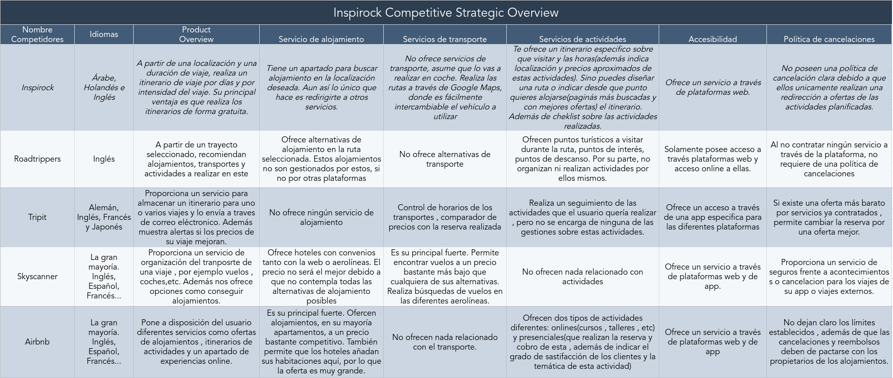

# DIU21
Prácticas Diseño Interfaces de Usuario 2020-21 (Tema: Turismo) 

Grupo: DIU1_01PJ.  Curso: 2020/21 
Updated: 4/3/2021

Proyecto: 
>>> Decida el nombre corto de su propuesta en la práctica 2 

Descripción: 

>>> Describa la idea de su producto en la práctica 2 

Logotipo: 
>>> Opcionalmente si diseña un logotipo para su producto en la práctica 3 pongalo aqui

Miembros
 * :bust_in_silhouette: Pablo Cordero Romero :octocat: [corderop](https://github.com/corderop)     
 * :bust_in_silhouette: Jairo Luis Abril Moya :octocat: [JairoLuisAbrilMoya](https://github.com/JairoLuisAbrilMoya)

----- 

# Proceso de Diseño 

## Paso 1. UX Desk Research & Analisis 

 1.a Competitive Analysis
-----

La aplicación que hemos elegido frente a las otros competidores es la de Inspirock. Esto es debido a que la aplicación tiene unos puntos fuertes e innovadores bastante interesantes , como por ejemplo es la realización de itinerarios concretos dentro de un período establecido y un lugar concreto. Dicha función puede llegar a ser muy específica como por ejemplo indicar el horario de las visitas a los lugares indicados de interés(culturales , deportivos , gatronómicos , etc). Además dicho itinerario puede ser especificado con las rutas más optimas. Una de las desventajas que puede tener es la que estas actividades  son redirigidas a otras páginas para efectuar sus reservas  y si existen algún cambio o incoveniente como cancelaciones, ellos no se hacen responsables. Otra de las desventajas será el pequeños espectro de idiomas que ofrece, algo clave para una aplicación de viajes.

 1.b Persona
-----

En primer lugar tenemos al usuario de Juan Bolivar, una persona con unas cualidades y conocimientos de tecnología actuales elevados. Debido a que se encuentra en un puesto de trabajo en el cuál debe usar ciertas herramientas de ofimática(como en general las personas), además que al ser una persona más joven tiene más facilidad de aprendizaje de nuevas tecnologías.

En segundo lugar tenemos Aliona Ekaterina, una persona que no ha estado tan familiarizada con las tecnologías actuales. Debido a las circunstancias personales que ha tenido en su vida , por tanto es un tipo de usuario que no tendrá tanta facilidad de comprensión y acceso a nuevas herramientas que no conozca previamente.

 1.c User Journey Map
----

Tenemos dos casos muy opuestos una persona familiarizada con las tecnologías que teniendo una cierta formación consigue el objetivo de obtener su itinerario (aunque tuve algunas dudas). Y una segunda persona que no esta familiarizada con el uso de la tecnología que tras no encontrar ayuda ni resultados o guias de funcionamiento claras dentro de la web decide rechazar nuestra página.

 1.d Usability Review
----

[Documento de review de usabilidad](./P1/Usability-review-realizado.pdf)
**Valoración final**: 70/100

En conclusión creemos que la puntuación refleja bien la usabilidad de la plataforma. Encontramos una página bastante equilibrada, con puntos fuertes y puntos débiles. Entre los puntos débiles podemos resaltar algunos problemas de accesibilidad debido a que muchas etiquetas de acciones no representan correctamente el resultado que finalmente se obtiene. Además la falta de apoyo de uso hace que requiera una pequeña curva de aprendizaje al usar la plataforma por primera vez. Como puntos fuertes destaca la interfaz de la aplicación, la cual es bastante limpia y clara. Además proporciona feedbacks de cada una de la actividades obtenidos de servicios externos que permiten hacerse una idea de como puede ser una actividad. Una vez tienes cierto conocimiento de como usar la página, permite una gran variedad de opciones relacionadas con los itinerarios (cambiar horarios, modificar actividades, etc.).

## Paso 2. UX Design  

 2.a Feedback Capture Grid / EMpathy map / POV
----

>>> Comenta con un diagrama los aspectos más destacados a modo de conclusion de la práctica anterior,

 Interesante | Críticas     
| ------------- | -------
  Preguntas | Nuevas ideas
  
    
>>> ¿Que planteas como "propuesta de valor" para un nuevo diseño de aplicación para economia colaborativa ?
>>> Problema e hipótesis
>>>  Que planteas como "propuesta de valor" para un nuevo diseño de aplicación para economia colaborativa te
>>> (150-200 caracteres)

 2.b ScopeCanvas
----
>>> Propuesta de valor 

 2.b Tasks analysis 
-----

>>> Definir "User Map" y "Task Flow" ... 

 2.c IA: Sitemap + Labelling 
----

>>> Identificar términos para diálogo con usuario  

Término | Significado     
| ------------- | -------
  Login¿?  | acceder a plataforma

 2.d Wireframes
-----

>>> Plantear el  diseño del layout para Web/movil (organización y simulación ) 

## Paso 3. Mi UX-Case Study (diseño)

 3.a Moodboard
-----

>>> Plantear Diseño visual con una guía de estilos visual (moodboard) 
>>> Incluir Logotipo
>>> Si diseña un logotipo, explique la herramienta utilizada y la resolución empleada. ¿Puede usar esta imagen como cabecera de Twitter, por ejemplo, o necesita otra?

  3.b Landing Page
----

>>> Plantear Landing Page 

 3.c Guidelines
----

>>> Estudio de Guidelines y Patrones IU a usar 
>>> Tras documentarse, muestre las deciones tomadas sobre Patrones IU a usar para la fase siguiente de prototipado. 

  3.d Mockup
----

>>> Layout: Mockup / prototipo HTML  (que permita simular tareas con estilo de IU seleccionado)

 3.e ¿My UX-Case Study?
-----

>>> Publicar my Case Study en Github..
>>> Documente y resuma el diseño de su producto en forma de video de 90 segundos aprox

## Paso 4. Evaluación 

 4.a Caso asignado
----

>>> Breve descripción del caso asignado con enlace a  su repositorio Github

 4.b User Testing
----

>>> Seleccione 4 personas ficticias. Exprese las ideas de posibles situaciones conflictivas de esa persona en las propuestas evaluadas. Asigne dos a Caso A y 2 al caso B
 

| Usuarios | Sexo/Edad     | Ocupación   |  Exp.TIC    | Personalidad | Plataforma | TestA/B
| ------------- | -------- | ----------- | ----------- | -----------  | ---------- | ----
| User1's name  | H / 18   | Estudiante  | Media       | Introvertido | Web.       | A 
| User2's name  | H / 18   | Estudiante  | Media       | Timido       | Web        | A 
| User3's name  | M / 35   | Abogado     | Baja        | Emocional    | móvil      | B 
| User4's name  | H / 18   | Estudiante  | Media       | Racional     | Web        | B 

. 4.c Cuestionario SUS
----

>>> Usaremos el **Cuestionario SUS** para valorar la satisfacción de cada usuario con el diseño (A/B) realizado. Para ello usamos la [hoja de cálculo](https://github.com/mgea/DIU19/blob/master/Cuestionario%20SUS%20DIU.xlsx) para calcular resultados sigiendo las pautas para usar la escala SUS e interpretar los resultados
http://usabilitygeek.com/how-to-use-the-system-usability-scale-sus-to-evaluate-the-usability-of-your-website/)
Para más información, consultar aquí sobre la [metodología SUS](https://cui.unige.ch/isi/icle-wiki/_media/ipm:test-suschapt.pdf)

>>> Adjuntar captura de imagen con los resultados + Valoración personal 

 4.d Usability Report
----

>> Añadir report de usabilidad para práctica B (la de los compañeros)

>>> Valoración personal 

## Paso 5. Evaluación de Accesibilidad  

  5.a Accesibility evaluation Report 
----

>>> Indica qué pretendes evaluar (de accesibilidad) sobre qué APP y qué resultados has obtenido 

>>> 5.a) Evaluación de la Accesibilidad (con simuladores o verificación de WACG) 
>>> 5.b) Uso de simuladores de accesibilidad 

>>> (uso de tabla de datos, indicar herramientas usadas) 

>>> 5.c Breve resumen del estudio de accesibilidad (de práctica 1) y puntos fuertes y de mejora de los criterios de accesibilidad de tu diseño propuesto en Práctica 4.

## Conclusión final / Valoración de las prácticas

>>> (90-150 palabras) Opinión del proceso de desarrollo de diseño siguiendo metodología UX y valoración (positiva /negativa) de los resultados obtenidos  

