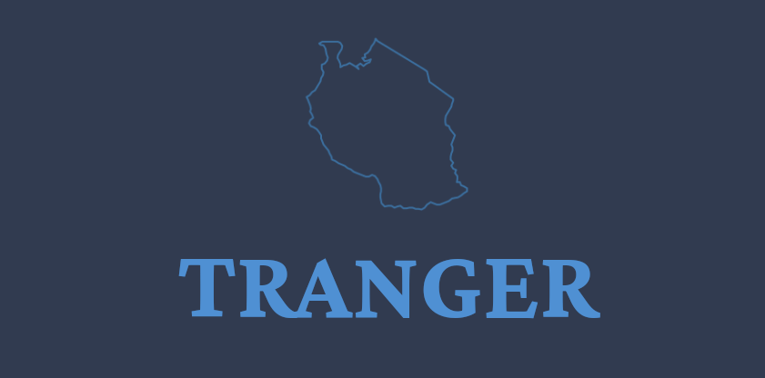
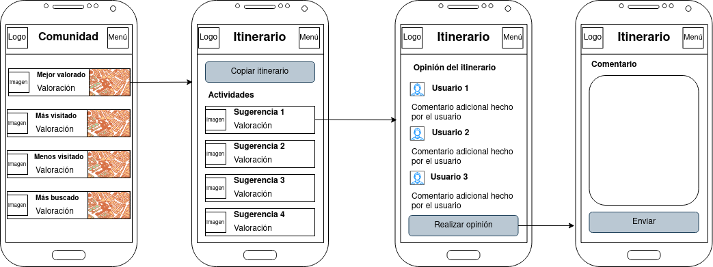
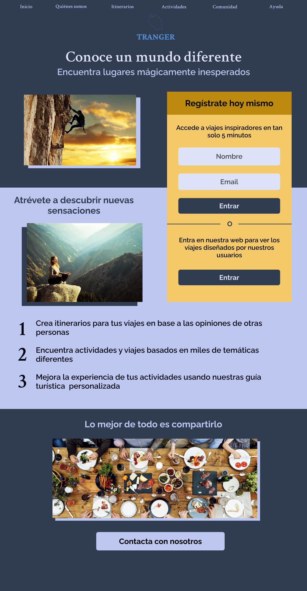

# DIU21
Prácticas Diseño Interfaces de Usuario 2020-21 (Tema: Turismo) 

Grupo: DIU1_01PJ.  Curso: 2020/21 
Updated: 13/05/2021

**Proyecto**: 

**Descripción**: 

Nuestro proyecto llamado Tranger consiste en una plataforma de creación de itinerarios alternativos. Dichos itinerarios pueden ser de diferentes temáticas(cultural, gastronómicos,deportivos,etc) , además se proporcionará una comunidad de la plataforma para consultar las experiencias de los usuarios en estos itinerarios o actividades. Por último se proporciona un guía turístico nativo del lugar que se visita para proporcionar una expercienca más intima y formativa de la actividad.

**Conoce nuestro trabajo**

https://user-images.githubusercontent.com/31637109/118174813-95864780-b42f-11eb-8f3d-2a631d21447e.mp4

Miembros
 * :bust_in_silhouette: Pablo Cordero Romero :octocat: [corderop](https://github.com/corderop)     
 * :bust_in_silhouette: Jairo Luis Abril Moya :octocat: [JairoLuisAbrilMoya](https://github.com/JairoLuisAbrilMoya)

----- 

# Proceso de Diseño 

## Paso 1. UX Desk Research & Analisis 

 1.a Competitive Analysis
-----

En primer lugar, pensamos en analizar la competencia en base a distintas aplicaciones, comparándolas con una de las que más llamativas de cara al usuario y la cual ofrecía algo diferente a su competencia. Esta era **Inspirock**, de la cuál nos gustó que estaba basa en la creación de itinerarios en un determinado lugar y durante unas fechas. 

[Pulsa aquí para ver como hemos analizado las diferentes alternativas](./P1/1.CompetitorAnalysis/Tabla_competitorAnalysis.png)

 1.b Persona
-----

Para analizar la plataforma anteriormente mencionada decidimos plantear dos tipos de personas que podrían interesarse y tener confrontaciones con el uso de la aplicación. Planteamos dos personas ficticias: Juan Bolívar y Aliona Ekaterina.

[Pulsa aquí para ver las características de Juan Bolívar](./P1/2.Persona/persona_hombre.png)

[Pulsa aquí para ver las características de Aliona Ekaterina](./P1/2.Persona/persona_mujer.png)

 1.c User Journey Map
----

Tras plantear los dos personas, queríamos realizar una simulación de uso de estas personas en la aplicación Inspirock. Hemos querido localizar los puntos débiles y puntos fuertes del funcionamiento y diseño de esta y de dicha forma plantear una mejor solución, evitando los errores de esta.

[Pulsa aquí para ver el Journey Map de Juan Bolívar](./P1/3.JourneyMaps/journeyMap_man.png)
[Pulsa aquí para ver el Journey Map de Aliona Ekaterina](./P1/3.JourneyMaps/journeyMap_woman.png)

 1.d Usability Review
----

Una de las cosas más importantes del diseño de una aplicación debe ser como de usable es esta aplicación de cara a diferentes puntos claves. Bajo un análisis de estándares de usabilidad, hemos llegado a la conclusión de que **Inspirock** no es aplicación perfecta en cuanto experiencia de usuario, pero cumple bastante bien con lo esencial, encontrándola bastante equilibrada. 

**Valoración final de Inspirock**: 70/100

[Pulsa aquí para ver el documento de review de usabilidad](./P1/Usability-review-realizado.pdf)

## Paso 2. UX Design  

 2.a Feedback Capture Grid / EMpathy map / POV
----

### Idea de proyecto en base a lo analizado 

En base a los resultados obtenidos tras el análisis, hemos encontrado una línea de trabajo a seguir en el planteamiento de **Tranger**, nuestra propuesta de aplicación, sobre algunas ideas de las aplicaciones analizadas, a partir de las cuales crear nuevas propuestas para nuestra aplicación.

#### Malla receptora de información 

En ella presentamos una planteamiento visual sobre las principales ideas que queremos potenciar y mejorar de las alternativas previas, además de proponer nuevas para el tipo de aplicación que buscamos conseguir.

[Pulsa aquí para ver la malla receptora completa](./P2/recursos/malla-receptora.png)

#### Mapa de empatía

A continuación, hemos realizar un análisis sobre los intereses que tendrán los personajes ficticios previamente propuestos, conforme a nuestra propuesta de aplicación.

 2.b ScopeCanvas
----

A partir de las ideas planteadas, buscamos llevarlas más al mundo real encontrando las necesidades que pueden surgir, los propósitos que nos tomamos en base a estas, cuales serán nuestros objetivos de cara al diseño de la aplicación y como esto se llevará a la realidad en **Tranger**.

 2.b Análisis de funcionalidades
-----

Una vez definido las ideas a seguir para realizar la aplicación, definimos las principales funcionalides de nuestra aplicación, conociendo los principales puntos a trabajar en nuestra app. También definimos como de importantes y prioritarias son cada una de estas. 

Tras un análisis de todas estas actividades hemos determinado que las funcionalidades más importantes son las relacionadas con las gestión de itinerarios, como es su creación, adición de actividades, etc. 

[Pulsa aquí para ver las funcionalidades junto con su importancia](P2#task-analysis)

 2.c Secciones del sitio y conceptos principales
----

Una vez teníamos las funcionalidades queríamos definir la estructura de estas para crear una visión sólida de toda la aplicación y los flujos de uso de esta.

Con las funcionalidades y las estructura de estas, decidimos definir aspectos importantes de nuestra aplicación de cara a simplificar o facilitar la comprensión de dichas ideas dentro de nuestro diseño. Los conceptos más importantes son:

| **Etiqueta**    | **Objetivo**                                                                                                                                                                                              |
|:---------------:|:---------------------------------------------------------------------------------------------------------------------------------------------------------------------------------------------------------:|
| Comunidad       | Aquí se encontrarán todos los itinerarios creados por otras personas junto con sus valoraciones. Se podrán copiar para tratarlos como uno propio en la sección de itinerarios.                            |
| Itinerario      | Conjunto de actividades a realizar en un viaje o visita a un lugar o localización.                                                                                                                        |
| Actividades     | Actividad realizada en un itinerario. Podrían ser eventos, lugares a visitar, planes...                                                                                                                   |
| Ayuda           | Apartado que proporciona una opción de consulta sobre dudas de nuestra plataforma o incluso guía del uso de ella.                                                                                         |
| Opinión         | Comentario escrito sin puntuación de un usuario acerca de un itinerario completo, enfocado a que se compartan experiencias entre usuarios.                                                                |
| Valorar         | Acción que permite obtener una ponderación del nivel de satisfacción del usuario dentro de la actividad, se realiza principalmente con un sistema de estrellas (1 estrella= malo; 5 estrellas=muy bueno). |
| Guía turística  | Guía acerca de una actividad, disponible en audio y texto, para ofrecer al usuario una mejor experiencia realizando esta actividad.                                                                       |
| Tutorial de uso | Indicaciones en pantalla para el usuario sobre las diferentes secciones y acciones principales de la app.                                                                                                 |
| Temática        | Clasificación del itinerario o actividad según su tipo o hacia quien esté orientada. Algunos ejemplos son: gastronómico, arquitectónico, cultural...                                                      |
| Reservar        | Indicar una fecha para realizar esa actividad, para que esta sea reservada por los organizadores.                                                                                                         |
| Registro        | Acción para la creación de un usuario. A este se le solicitará el correo electrónico, así como una contraseña para acceder.                                                                               |

 2.d Wireframes
-----

Para plasmar la idea de como sería nuestra aplicación creamos unos bocetos que muestra como queremos enfocar el resultado final.

#### Inicio y login

#### Itinerario

#### Actividades

#### Ayuda

#### Comunidad

## Paso 3. Mi UX-Case Study (diseño)

 3.a Moodboard
-----

Para el logotipo hemos querido utilizar el color principal planteador en el [diseño visual](enlace) y hacerlo sobre un fondo sólido. Esto entre otras cosas nos permitirá adaptarlo a diferentes formatos y resoluciones, así como usarlo en negativo. Por otra parte, quisimos reflejar en el la temática de la aplicación representando la forma de un país en él. 

  3.b Landing Page
----

La captación de nuevos clientes la planteamos mediante una landing page, que podrá utilizarse en varios ámbitos, buscando clientes indecisos o aquellos que no conocen la aplicación. 

 3.c Guidelines
----

Hemos querido enfocar la aplicación a dispositivos móviles, ya que con el auge de la telefonía móvil, sería mucho más fácil llegar a un público más amplio. Para esto hemos seguido patrones altemente probados en móviles como son los presentados por Google con Material Design, centrándonos principalmente en estos dispositivos y en como son usados.

  3.d Mockup
----

Siguiendo los patrones de diseño y las ideas planteadas en todo el proceso, hemos realizado unos mockups que permitirán guiar una fase de desarrollo posterior. Esta es la primera alternativa de diseño presentada de los principales componentes de la aplicación:

3.e Case Study
----

Puedes obtener una visión más reducida (136 segundos) de nuestro estudio y de **Tranger** en el siguiente video: 

https://user-images.githubusercontent.com/31637109/118174813-95864780-b42f-11eb-8f3d-2a631d21447e.mp4

## Paso 4. Evaluación 

 4.a Caso asignado
----

>>> Breve descripción del caso asignado con enlace a  su repositorio Github

 4.b User Testing
----

>>> Seleccione 4 personas ficticias. Exprese las ideas de posibles situaciones conflictivas de esa persona en las propuestas evaluadas. Asigne dos a Caso A y 2 al caso B
 

| Usuarios | Sexo/Edad     | Ocupación   |  Exp.TIC    | Personalidad | Plataforma | TestA/B
| ------------- | -------- | ----------- | ----------- | -----------  | ---------- | ----
| User1's name  | H / 18   | Estudiante  | Media       | Introvertido | Web.       | A 
| User2's name  | H / 18   | Estudiante  | Media       | Timido       | Web        | A 
| User3's name  | M / 35   | Abogado     | Baja        | Emocional    | móvil      | B 
| User4's name  | H / 18   | Estudiante  | Media       | Racional     | Web        | B 

. 4.c Cuestionario SUS
----

>>> Usaremos el **Cuestionario SUS** para valorar la satisfacción de cada usuario con el diseño (A/B) realizado. Para ello usamos la [hoja de cálculo](https://github.com/mgea/DIU19/blob/master/Cuestionario%20SUS%20DIU.xlsx) para calcular resultados sigiendo las pautas para usar la escala SUS e interpretar los resultados
http://usabilitygeek.com/how-to-use-the-system-usability-scale-sus-to-evaluate-the-usability-of-your-website/)
Para más información, consultar aquí sobre la [metodología SUS](https://cui.unige.ch/isi/icle-wiki/_media/ipm:test-suschapt.pdf)

>>> Adjuntar captura de imagen con los resultados + Valoración personal 

 4.d Usability Report
----

>> Añadir report de usabilidad para práctica B (la de los compañeros)

>>> Valoración personal 

## Paso 5. Evaluación de Accesibilidad  

  5.a Accesibility evaluation Report 
----

>>> Indica qué pretendes evaluar (de accesibilidad) sobre qué APP y qué resultados has obtenido 

>>> 5.a) Evaluación de la Accesibilidad (con simuladores o verificación de WACG) 
>>> 5.b) Uso de simuladores de accesibilidad 

>>> (uso de tabla de datos, indicar herramientas usadas) 

>>> 5.c Breve resumen del estudio de accesibilidad (de práctica 1) y puntos fuertes y de mejora de los criterios de accesibilidad de tu diseño propuesto en Práctica 4.

## Conclusión final / Valoración de las prácticas

>>> (90-150 palabras) Opinión del proceso de desarrollo de diseño siguiendo metodología UX y valoración (positiva /negativa) de los resultados obtenidos  

